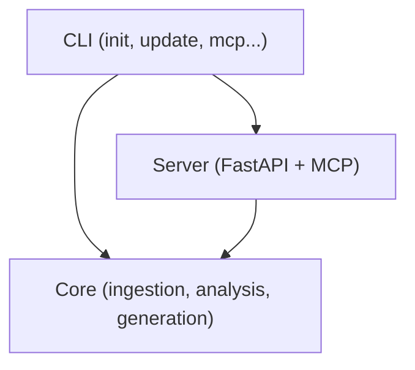

# MCP Server
{: .no_toc }

Connect repowise to Claude Code, Codex, Cursor, Cline, or any MCP-compatible editor.
{: .fs-6 .fw-300 }

---

## Table of contents
{: .no_toc .text-delta }

1. TOC
{:toc}

---

## Overview

The MCP (Model Context Protocol) server is how repowise talks to AI coding assistants. Once connected, your editor's AI can call 10 tools to query your codebase wiki — synthesizing answers, looking up symbols, fetching docs, ownership, risk signals, dependency paths, and architectural decisions.

Start the server with:

```bash
repowise mcp [PATH]
```

---

## Connecting to editors

### Claude Code

**Via plugin (recommended):** The repowise Claude Code plugin registers the MCP server automatically. See [Claude Code Plugin →](claude-code-plugin).

**Manual setup:** Add this to `.mcp.json` at your repo root:

```json
{
  "mcpServers": {
    "repowise": {
      "command": "repowise",
      "args": ["mcp", "/path/to/your-repo"],
      "description": "repowise codebase intelligence"
    }
  }
}
```

If you're running repowise for the current directory, you can omit the path:

```json
{
  "mcpServers": {
    "repowise": {
      "command": "repowise",
      "args": ["mcp"]
    }
  }
}
```

### Codex

Run the Codex setup command from your repository:

```bash
repowise init --codex
```

This writes project-local `.codex/config.toml` with a Repowise MCP server entry:

```toml
[mcp_servers.repowise]
command = "repowise"
args = ["mcp"]
cwd = "/path/to/your-repo"
startup_timeout_sec = 20
```

It also writes `.codex/hooks.json` and managed `AGENTS.md`. See [Codex Integration](codex).

### Cursor

Add to `.cursor/mcp.json` in your repo or `~/.cursor/mcp.json` globally:

```json
{
  "mcpServers": {
    "repowise": {
      "command": "repowise",
      "args": ["mcp", "/path/to/your-repo"]
    }
  }
}
```

### Cline

Add to Cline's MCP settings file (`cline_mcp_settings.json`):

```json
{
  "mcpServers": {
    "repowise": {
      "command": "repowise",
      "args": ["mcp", "/path/to/your-repo"],
      "disabled": false,
      "autoApprove": ["get_overview", "get_context", "search_codebase"]
    }
  }
}
```

### Windsurf

Add to Windsurf's MCP configuration:

```json
{
  "mcpServers": {
    "repowise": {
      "command": "repowise",
      "args": ["mcp", "/path/to/your-repo"]
    }
  }
}
```

---

## Transport protocols

### stdio (default)

The default transport. The MCP server runs as a subprocess of your editor, communicating over stdin/stdout. This is the correct option for Claude Code, Codex, Cursor, Cline, and Windsurf.

```bash
repowise mcp                         # stdio, current directory
repowise mcp /path/to/repo           # stdio, specific repo
repowise mcp --transport stdio       # explicit
```

### SSE (Server-Sent Events)

For web-based MCP clients or headless setups where a persistent HTTP server is preferable.

```bash
repowise mcp --transport sse              # SSE on port 7338
repowise mcp --transport sse --port 8080  # Custom port
```

Clients connect to `http://localhost:7338/sse` and receive server-sent events. Configure with `REPOWISE_MCP_PORT` env var or `mcp.settings.port` in `.repowise/mcp.json`.

---

## The 10 tools

### `get_answer(question, scope?)`

One-call RAG over the wiki layer. Runs retrieval, gates on confidence, and synthesizes a 2–5 sentence answer with concrete file/symbol citations. Responses are cached per repository by question hash, so repeated questions cost nothing on the second call.

**Parameters:**
- `question` (string) — natural-language developer question
- `scope` (optional, string) — path prefix to restrict retrieval (e.g. `"src/auth/"`)

**Returns:**
- `answer` (string) — synthesized 2–5 sentence answer
- `citations` (list of strings) — file paths backing the answer
- `confidence` (string) — `"high"`, `"medium"`, or `"low"`. High-confidence answers can be cited directly without verification reads; lower confidence indicates the agent should fall back to `search_codebase` or `Read`.
- `fallback_targets` (list of strings) — top retrieval hits the agent should `Read` if it does not trust the synthesized answer
- `retrieval` (list) — raw top-N hits with snippets

**When to use:** First call on any code question. Collapses the typical "search → read → reason" loop into a single round-trip.

**Example:**
```
get_answer(question="how does the request context get pushed and popped per request")

→ answer: "Flask pushes a RequestContext onto _request_ctx_stack at the start
  of every request via Flask.wsgi_app, and pops it in the corresponding
  finally clause. The push happens in src/flask/app.py::Flask.wsgi_app."
  citations: ["src/flask/app.py", "src/flask/ctx.py"]
  confidence: "high"
```

---

### `get_symbol(symbol_id)`

Resolves a fully-qualified symbol identifier to its definition. Returns the source body, signature, file location, line range, and any associated docstring without the agent having to grep then read.

**Parameters:**
- `symbol_id` (string) — qualified id of the form `path/to/file.py::ClassName::method_name`. Both `::` and `.` are accepted as the symbol separator (`Class::method` and `Class.method` resolve identically).

**Returns:**
- `symbol_id`, `name`, `kind` (`class`, `function`, `method`, …)
- `file_path`, `start_line`, `end_line`
- `signature` (recovered from source so base classes, decorators, and full type annotations are preserved)
- `body` (the symbol's source code)
- `docstring`

**When to use:** When the question names a specific class, function, or method and you want its source without a separate `Read` call.

---

### `get_overview()`

Returns a high-level architecture summary of the indexed repository: key modules, entry points, tech stack, git health (churn percentiles, bus factors), and recent activity trends.

**When to use:** Start every new task by calling this. It orients the AI and surfaces risk signals before any code is read.

**Example response:**
```
Repository: repowise
Architecture: Python monorepo (cli, core, server, web)
Entry points: packages/cli/src/repowise/cli/main.py
Tech stack: Python, FastAPI, SQLite, LanceDB, Next.js
Top hotspots: init_cmd.py (99.8th %ile), test_mcp.py (99.5th %ile)
Bus factor risk: git_indexer.py (1 author)
```

---

### `get_context(targets, include?, compact?)`

Returns rich context for one or more files, modules, or symbols: documentation, ownership, last change, governing decisions, and freshness status.

**Parameters:**
- `targets` (list of strings) — file paths, module names, or symbol names
- `include` (optional) — subset of `["docs", "ownership", "last_change", "decisions", "freshness"]`
- `compact` (optional, default `True`) — when `True`, drops the `structure` block, the `imported_by` list, and per-symbol docstrings/end-line fields to keep the response under ~10K characters. Pass `compact=False` to receive the full payload, e.g. when you specifically need the import-graph dependents or every symbol docstring on a dense file.

**When to use:** Before reading or editing any file. Faster and richer than reading the raw source.

**Example:**
```
get_context(targets=["packages/cli/src/repowise/cli/commands/init_cmd.py"])

→ Purpose: Orchestrates the 4-phase init pipeline
  Owner: RaghavChamadiya (89% of commits)
  Last changed: 3 days ago (14 commits in 90d — 99.8th %ile)
  Decisions: "Use interactive mode when stdin is a TTY"
  Freshness: current
```

---

### `get_risk(targets)`

Returns a modification risk assessment for each target file.

**Parameters:**
- `targets` (list of strings) — file paths

**Returns per file:**
- Churn percentile rank
- Number of direct and transitive dependents
- Co-change partners (files that tend to change together)
- Bus factor (number of authors with meaningful ownership)
- Change trend: increasing / decreasing / stable

**When to use:** Required before making changes to any file, especially in hotspot areas.

**Example:**
```
get_risk(targets=["packages/core/src/repowise/core/ingestion/git_indexer.py"])

→ Hotspot: 99.3th %ile (9 commits in 90 days)
  Dependents: 7 direct, 23 transitive
  Co-change partners: init_cmd.py, update_cmd.py
  Bus factor: 1 (sole author: RaghavChamadiya)
  Trend: increasing
  Recommendation: High risk — coordinate before changing
```

---

### `get_why(query?, targets?)`

Searches for architectural decisions and intent behind code structure.

**Parameters:**
- `query` (string) — natural language question ("why JWT instead of sessions?")
- `targets` (optional, list) — file paths to focus on

**Returns:**
- Matching decision records with title, rationale, and status
- Git archaeology: commit messages and PR descriptions that explain design choices
- Origin story for specific files (if `targets` provided)
- Decision health (staleness scores for applicable decisions)

**When to use:** Before any architectural change. Ask "why is this structured this way" before refactoring.

**Example:**
```
get_why(query="why is rate limiting done in the app layer")

→ Decision: "Rate limiting at application layer"
  Rationale: Need per-user limits; load balancer can't distinguish users
  Status: active
  Source: cli (manually recorded)
  Affected: server/middleware/rate_limit.py
```

---

### `search_codebase(query, limit?, page_type?)`

Semantic search over the full wiki using natural language.

**Parameters:**
- `query` (string) — natural language query
- `limit` (int, default 5) — max results
- `page_type` (optional) — filter to `"file"`, `"module"`, or `"repository"`

**Returns:** Ranked list of wiki pages with relevance scores and short excerpts. Recently-changed files receive a freshness boost.

**When to use:** When locating code — prefer over `grep`/`find` for conceptual searches.

**Example:**
```
search_codebase(query="how database connections are pooled")

→ 1. packages/server/src/repowise/server/db.py (0.92)
     "Creates async SQLAlchemy engine with connection pooling..."
  2. packages/core/src/repowise/core/persistence/session.py (0.87)
     "Session factory configured with pool_size=5..."
```

---

### `get_dependency_path(source, target)`

Finds the dependency path between two files or modules through the graph.

**Parameters:**
- `source` (string) — starting file/module
- `target` (string) — destination file/module

**Returns:** The shortest path with edge types (imports, calls). When no direct path exists, returns nearest common ancestors, shared neighbors, and bridge suggestions.

**When to use:** When tracing how modules connect, understanding blast radius, or planning refactors.

**Example:**
```
get_dependency_path(
  source="packages/cli/src/repowise/cli/commands/init_cmd.py",
  target="packages/core/src/repowise/core/persistence/db.py"
)

→ init_cmd.py → orchestrator.py → persistence/writer.py → db.py
  (3 hops, all import edges)
```

---

### `get_dead_code(kind?, min_confidence?, safe_only?, tier?, directory?)`

Returns a tiered report of unused code.

**Parameters:**
- `kind` — filter by `unreachable_file`, `unused_export`, `unused_internal`, `zombie_package`
- `min_confidence` — 0.0–1.0, default 0.4
- `safe_only` — only return findings marked `safe_to_delete`
- `tier` — `high`, `medium`, or `low`
- `directory` — limit to a specific directory
- `group_by` — `directory` or `owner`

**When to use:** Before any cleanup or removal tasks. Gives confirmed unused code rather than guesses.

---

### `get_architecture_diagram(scope?, path?, diagram_type?, show_heat?)`

Generates a Mermaid diagram of the architecture.

**Parameters:**
- `scope` — `"repo"` (default), `"module"`, or `"file"`
- `path` — required for module/file scope
- `diagram_type` — `"auto"`, `"flowchart"`, `"class"`, or `"sequence"`
- `show_heat` — boolean; colors nodes by churn intensity (red = hot, green = cold)

**When to use:** For documentation, architecture reviews, or understanding unfamiliar areas.

**Example output:**


---

## How AI editors use these tools

The tools are designed to form a decision workflow:

1. **Before any task** → `get_overview()` to orient
2. **Before reading a file** → `get_context(targets=[...])` instead of reading raw source
3. **Before editing a file** → `get_risk(targets=[...])` to assess impact
4. **When facing an architectural question** → `get_why(query="...")` before changing structure
5. **When locating code** → `search_codebase(query="...")` before grep
6. **After making changes** → `update_decision_records(action="create", ...)` to record decisions

The [CLAUDE.md generator](claude-md-generator) writes these instructions directly into your project's CLAUDE.md, so Claude Code follows this workflow automatically. Codex setup writes the same workflow into managed `AGENTS.md`.
